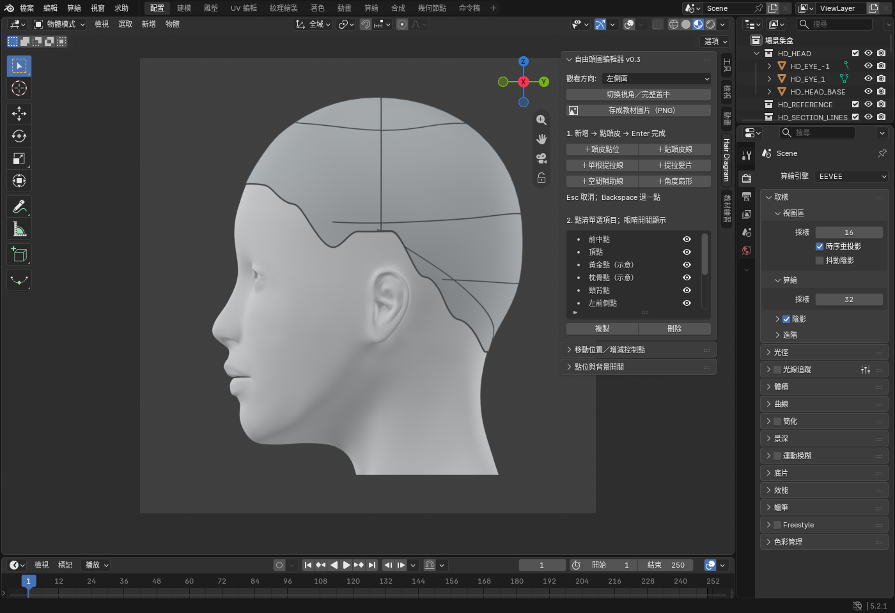

# Hair Diagram — User Guide

Hair Diagram is a Blender tool for authoring technical hair education diagrams. This guide assumes familiarity with Blender navigation, add-on management, and file operations. Interface labels remain in Traditional Chinese; the labels below identify the existing controls.

## Installation and session setup

Complete the [manual installation procedure](../README.md#manual-installation). Enable Hair Diagram yourself in Blender Preferences before opening `blender/scenes/editor_head.blend` through File → Open. In the 3D Viewport, press N and select the Hair Diagram tab. For subsequent sessions, verify the add-on is enabled and manually open your saved `.blend` file.

## Starter scene

The initial view contains the head, hairline, and unlabelled construction lines. The head, eyes, scalp, hairline, and initial construction lines are locked against viewport selection and excluded from the editable item list. This selection lock does not exclude them from rendering. Newly created elements remain editable.

Use **點位與背景開關** (landmarks and background visibility) and **初始結構線（鎖定）** (locked initial construction lines) to control reference visibility. The current rear reference connections run from the ear-side intersections to the slightly lowered B.P. landmark. Opening an updated file is a manual operation; an already open scene does not update itself.

Optional landmarks are stored in the item list. The separate **教材練習** course panel requires a lesson catalog and book pages, which are not bundled in this public distribution.

## Author a 45-degree rear panel

1. Set **觀看方向** (view direction) to **後左斜看** (rear-left oblique), then select **切換視角／完整置中** (switch view / frame all). Viewing direction does not change panel elevation.
2. Select **＋提拉髮片** (add elevation panel). Click successive root positions on the visible rear scalp, then press Enter. The points define the root line; this is point placement, not freehand dragging.
3. Select the new panel in the item list. Set **角度基準** to **髮片中心頭皮（平行提拉）** (panel-center scalp, parallel elevation), **提拉角度** to 45, and **髮長** to 7 cm.
4. Set **髮片畫法** to **半透明色面＋髮束線** (transparent surface with strands). Select **套用到這一項** (apply to this item).
5. Add another panel and assign 90 degrees, or use **複製** (duplicate) and edit the copy. A duplicate initially overlaps its source; reposition it using **重新點整條根線** (replace the entire root line).

Changes apply only to the selected item after pressing Apply. Scroll the sidebar to access lower settings. To replace a numeric value, double-click it, select its contents, enter the value, and confirm.

During point placement, Backspace removes the last point, Enter completes the element, and Esc cancels creation. Scalp elements require visible scalp inside the hairline; the face, ears, and background are invalid placement targets. Complete a segment and change view before extending around an occluded surface. Middle-mouse navigation is available during placement.

## Element types

| Interface control | Placement | Result |
|---|---|---|
| ＋頭皮點位 | One scalp click | Named, movable landmark |
| ＋貼頭皮線 | At least two scalp points, then Enter | Surface-following section line |
| ＋單根提拉線 | One root click | Single strand with elevation and length |
| ＋提拉髮片 | Root-line points, then Enter | Panel with elevation, length, and display style |
| ＋空間輔助線 | At least two points, then Enter | Spatial guide with optional dashes or arrow |
| ＋角度扇形 | One scalp click | Angle comparison from 0 to 180 degrees in 30-degree steps |

For a spatial guide, subsequent points lie in the view-facing plane through the first point. The first point may be on the background. This does not independently specify every point's 3D depth.

Select a surface line and use **從這條線新增髮片** (create panel from this line) to create a panel. The source line is retained; the two items are independent afterward.

## Panel display styles

| Interface label | Appearance |
|---|---|
| 只有外框 | Outline only |
| 外框＋髮束線 | Outline and strands |
| 半透明色面＋髮束線 | Transparent surface and strands |
| 間隔色帶＋髮束線 | Alternating ribbons and strands |

**髮束線數量** controls strand density. Line thickness, line/point color, and panel outline/surface color are independent settings. Apply after changing them, including dash or arrow options where available.

## Elevation references and swivel

| Interface label | Reference |
|---|---|
| 各毛根頭皮 | Each root uses its own local scalp direction. At 90 degrees strands follow different local normals. |
| 髮片中心頭皮（平行提拉） | The panel-center scalp reference gives all strands a shared direction. |
| 垂直向下為 0° | World reference: 0 points down, 90 is horizontal, and 180 points up. |

With scalp references, **轉向** (swivel) rotates the zero-elevation reference direction on the scalp. At 90-degree elevation, strands still point along the applicable normal, so swivel does not change their direction.

With the world reference, swivel 0 points toward the face, 90 toward the model's left, 180 toward the rear, and -90 toward the model's right. A horizontal rearward panel uses world reference, elevation 90, swivel 180. An upward panel uses world reference and elevation 180.

At the scalp apex there is no unique tangential downward direction, so the tool uses a forward reference near that location. These are geometric conventions; they do not simulate gravity or determine the final haircut.

## Length and cutting plane

**髮尾形狀** (tip shape) supports:

- **等長**: equal strand lengths.
- **兩端不同長**: interpolate from **髮長** at the first root point to **末端髮長** at the last. Order follows point placement.
- **平面切口**: terminate strands at a cutting plane, with its angle separate from elevation.

A cutting-plane angle of 90 degrees places the plane perpendicular to the central strand. Angles 45 and 135 tilt in opposite directions. This definition is specific to the tool and may differ from another teaching system.

An error about a cut behind the roots or parallel to the strands means the chosen geometry has no valid intersection. Adjust elevation, length, or cut angle, or return to equal length. Failed updates preserve the previous geometry and other items.

## Landmarks and reference visibility

In **點位與背景開關**, toggle **頭皮點位** (landmarks), **點位名稱** (labels), **參考網格** (reference grid), **髮際線** (hairline), and **灰色頭皮** (scalp surface). These controls affect both the viewport and image output.

Select a point in the item list to rename it and Apply. Point size, text size, and horizontal/vertical label offsets can be edited. The item eye icon hides an individual point.

Initial landmarks include the front center, apex, golden point, occipital point, nape, and bilateral front-side, above-ear, and behind-ear points. These are adjustable schematic locations, not measured anatomy or universal terminology.

## Control-point editing

Select a line or panel, expand **移動位置／增減控制點**, and enable **顯示所選項目的控制點編號** to display numbered editing handles. These numbers are excluded from image output. Set **第幾個控制點** to the target index.

| Control | Operation |
|---|---|
| 移動這一點 → 再點頭皮 | Move the indexed point with a new scalp click |
| 在這點後插入一點 | Insert a point after the selected index |
| 刪除這個控制點 | Remove the indexed point; lines require at least two points |
| 重新點整條根線 | Replace the root line with two or more points, then Enter; preserve angle and style settings |

Landmarks, single elevation lines, and angle fans can also be moved using the point-move control. Disable handle numbering after editing if it obscures the view.

## Item management

Use the sidebar item list as the selection authority; clicking a viewport object does not necessarily select the matching list entry. The eye icon hides an item while retaining its settings, including for rendering. Select an item and use **刪除** to delete it. Use Blender Undo (Ctrl+Z with the viewport focused) to reverse an operation. Copies can have independent positions and parameters.

## Export and save

Apply pending changes, select a viewing direction, and frame the content. Choose **存成教材圖片（PNG）**, specify the destination and filename in Blender's file browser, and confirm export.

The output is a 2000 × 2000 transparent PNG. Automatic framing keeps panels inside the image. Disable **自動完整置中** in the export dialog when multiple diagrams must retain the same camera scale. Use the export operator for teaching illustrations rather than viewport screenshots.

Use **File → Save As** to save your own `.blend` under a new name. It preserves root lines, landmarks, angles, and other editing parameters; PNG files do not. To resume, start Blender, ensure Hair Diagram is enabled in Preferences, and manually open your saved file. Keep the starter as a separate original.

## Troubleshooting

| Symptom | Action |
|---|---|
| Hair Diagram tab is missing | Verify manual installation and enablement in Preferences; focus the 3D Viewport and open its N-panel |
| Other controls are unavailable during creation | Complete placement with Enter or cancel with Esc |
| Scalp clicks have no effect | Target visible scalp inside the hairline, not face, ears, or background |
| A panel appears as a single line | Change the view; the panel may be edge-on |
| New parameter values do not change the diagram | Select the intended list item and press Apply |
| A point cannot be found | Scroll the item list and check both individual and global visibility |
| Geometry extends outside the view | Use switch view / frame all |
| Chinese text is unavailable in a newly constructed scene | Ensure the manually installed add-on includes its `assets/vendor/noto` directory |

Elements retain their actual 3D positions across views. Spatial guides remain spatial guides rather than scalp lines. Natural hair fall and hair collision are not simulated.
